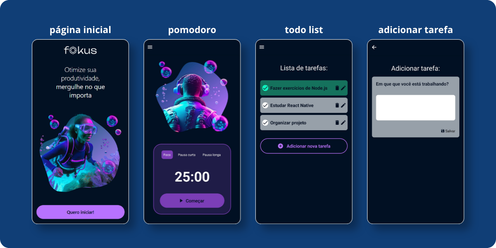

<div align="center">

  
  
  

   <h1>Pomodoro & To-Do</h1>
</div>

### Sobre o projeto:


Este projeto faz parte da trilha:

> [React Native: Desenvolva seu primeiro app](https://cursos.alura.com.br/formacao-react-native-primeiro-app)

Cursos envolvidos:

* [React Native: desenvolvendo com Expo](https://cursos.alura.com.br/course/react-native-desenvolvendo-expo)
* [React Native: navegando entre telas com Expo Router](https://cursos.alura.com.br/course/react-native-navegando-entre-telas-expo-router)

---

### Funcionalidades:

#### Pomodoro Timer

* Timer baseado na técnica Pomodoro
* Controle de foco e descanso

#### To-Do List

* Criar tarefas
* Listar tarefas
* Navegação entre telas

---

### Como rodar o projeto:

#### Pré-requisitos
Antes de começar, você precisa ter instalado:

- Node.js (LTS recomendado) → https://nodejs.org/
- npm (já vem com Node) ou yarn
- App Expo Go no celular (Android/iOS)

Opcional:
- Android Studio (emulador Android)
- Xcode (somente macOS para iOS Simulator)

#### 1️⃣ Clone o repositório

<pre>
<span style="color:#00bcd4;">git</span> clone https://github.com/MarianSantos14/fokus-mobile.git
<span style="color:#00bcd4;">cd</span> fokus-mobile
</pre>

#### 2️⃣ Instale as dependências

<pre>
<span style="color:#00bcd4;">npm</span> install
</pre>

ou

<pre>
<span style="color:#00bcd4;">yarn</span>
</pre>

#### 3️⃣ Inicie o projeto

<pre>
<span style="color:#00bcd4;">npx</span> expo start
</pre>

#### 4️⃣ Execute

* 📱 Expo Go (celular)
* 🤖 Emulador Android
* 🍎 Simulador iOS
* 🌐 Web

---

### 📁 Estrutura:

```bash
app/
 ┣ tasks/
 ┣ add-task/
 ┣ edit-task/
 ┣ pomodoro.jsx
 ┗ _layout.js

components/
 ┣ context/
 ┗ Footer.jsx
```

---

###  Aprendizados:

* Navegação com Expo Router
* Context API
* Estruturação de app React Native
* UI e UX básica

---
<br>

Obs: Projeto com fins educacionais desenvolvido durante cursos da Alura.
